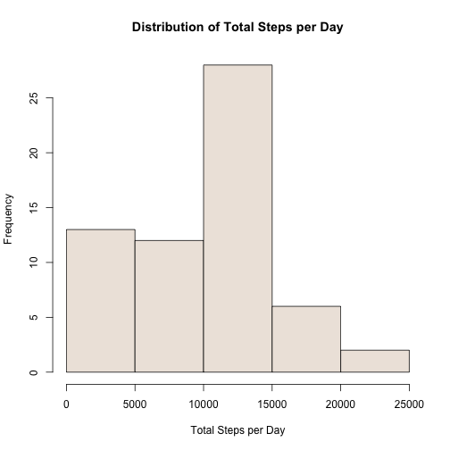
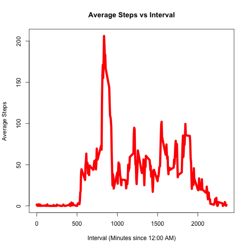
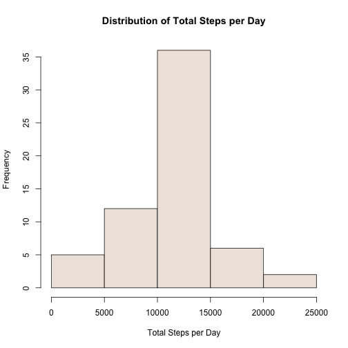
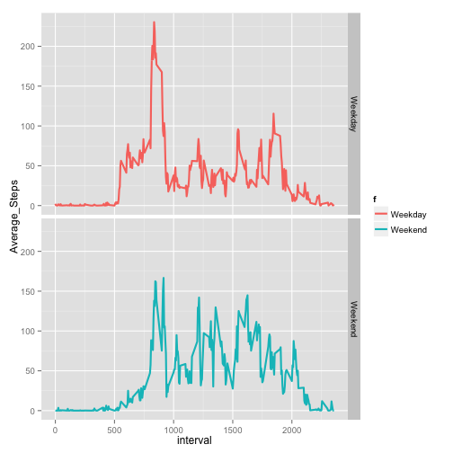

This is an R Markdown document. Markdown is a simple formatting syntax for authoring HTML, PDF, and MS Word documents. For more details on using R Markdown see <http://rmarkdown.rstudio.com>.

#Contents
-**Overview**

-**Explore Data (without addressing missing values)**

-**Missing Values** Count missing values, replace with estimated values, and observe impact of change on some results.

-**Differences in Activity Patterns between Weekdays and Weekends**

#Overview
This report analyzes data from a device worn by a person,  which records number of steps taken in 5 minute intervals over a 2 month period. Each observation includes the date, interval ID and number of steps taken.
Data was obtained from (https://d396qusza40orc.cloudfront.net/repdata%2Fdata%2Factivity.zip) on November 11, 2015.

#Explore Data

```r
library(dplyr)
```

```
## 
## Attaching package: 'dplyr'
## 
## The following objects are masked from 'package:stats':
## 
##     filter, lag
## 
## The following objects are masked from 'package:base':
## 
##     intersect, setdiff, setequal, union
```

```r
library(ggplot2)
```
##Read Data


```r
setwd("~/Documents/Coursera/ReproducibleResearch/PeerAssessment1")
stepData <- read.csv("./activity.csv")
#show example of data (pick rows where there is no NA)
"Sample rows"
```

```
## [1] "Sample rows"
```

```r
stepData[300:305,]
```

```
##     steps       date interval
## 300     0 2012-10-02       55
## 301     0 2012-10-02      100
## 302     0 2012-10-02      105
## 303     0 2012-10-02      110
## 304     0 2012-10-02      115
## 305     0 2012-10-02      120
```

##Find Distribution of Total Steps per Day, Mean and Median of Total Steps per Day

```r
by_date<-group_by(stepData,date)
xy <-summarize(by_date,Total_Steps=sum(steps,na.rm=TRUE))
hist(xy$Total_Steps,xlab="Total Steps per Day",main="Distribution of Total Steps per Day",col="seashell2")
```

 

###Calculate Mean of Total Steps

```r
mean(xy$Total_Steps)
```

```
## [1] 9354.23
```
###Calculate Median of Total Steps

```r
median(xy$Total_Steps)
```

```
## [1] 10395
```
##Average Daily Activity Pattern
###Calculate Average Steps by Interval


```r
by_interval=group_by(stepData,interval)
xy <-summarize(by_interval,Average_Steps=mean(steps,na.rm=TRUE))
plot(xy,ylab="Average Steps",xlab="Interval (Minutes since 12:00 AM)",main="Average Steps vs Interval",col="red",type="l",lwd=6)
```

 

###Interval with Maximum Steps

```r
xy$interval[match(max(xy$Average_Steps),xy$Average_Steps)]
```

```
## [1] 835
```
#About Missing Values

In the plots and calculations above, missing values were ignored.  Now they are to be replaced.  What is a reasonable estimate for the replacement value for each missing value?  The steps taken vary by day and by interval. Suggested estimates are the daily mean or the interval mean.

###Count Intervals Missing Value for steps Variable

```r
sum(is.na(stepData$steps))
```

```
## [1] 2304
```
###Process Data:  Replace Each Missing Value with Mean Value for the Corresponding Interval.


```r
stepDataClean<-stepData
use <- is.na(stepData$steps)
NAintervals<-stepData[use,3]
replacements <-xy$Average_Steps[match(NAintervals,xy$interval)]
stepDataClean$steps[use]<-replacements
```
##Find Distribution of Total Steps per Day, Mean and Median of Total Steps per Day, using Processed Data

```r
by_date<-group_by(stepDataClean,date)
xy <-summarize(by_date,Total_Steps=sum(steps,na.rm=TRUE))
hist(xy$Total_Steps,xlab="Total Steps per Day",main="Distribution of Total Steps per Day",col="seashell2")
```

 

###Calculate Mean of Total Steps, using Processed Data

```r
mean(xy$Total_Steps)
```

```
## [1] 10766.19
```
###Calculate Median of Total Steps, using Processed Data

```r
median(xy$Total_Steps)
```

```
## [1] 10766.19
```
##Compare Calculations on Processed Data to Calculations on Data with Missing Values
Distribution is more symmetrical for processed data, but it is centered about the same as the unprocessed data
Mean of unprocessed data is 9354.23; mean of processed data is 10766.19. 
Median of unprocessed data is 10395; median of processed data is 10766.19.
Notice that the median and mean are the same in the processed data!

#Differences in Activity Patterns between Weekdays and Weekends
##Create a Factor Variable, with Values "Weekday" and "Weekend"

```r
d <-as.character(stepDataClean$date)
f <-weekdays(as.Date(d))
 use <- f %in% c("Saturday","Sunday")
 f[use]<-"Weekend"
 f[!use]<-"Weekday"
 stepDataClean<-cbind(stepDataClean,f)
```
##Compare Weekday and Weekend Activity in Panel Plot


```r
by_day<-group_by(stepDataClean,interval,f)
xy <-summarize(by_day,Average_Steps=mean(steps))
g <-ggplot(xy,aes(interval,Average_Steps))
g <- g + geom_line(aes(color=f),size=1) + facet_grid(f~.)
print(g)
```

 
